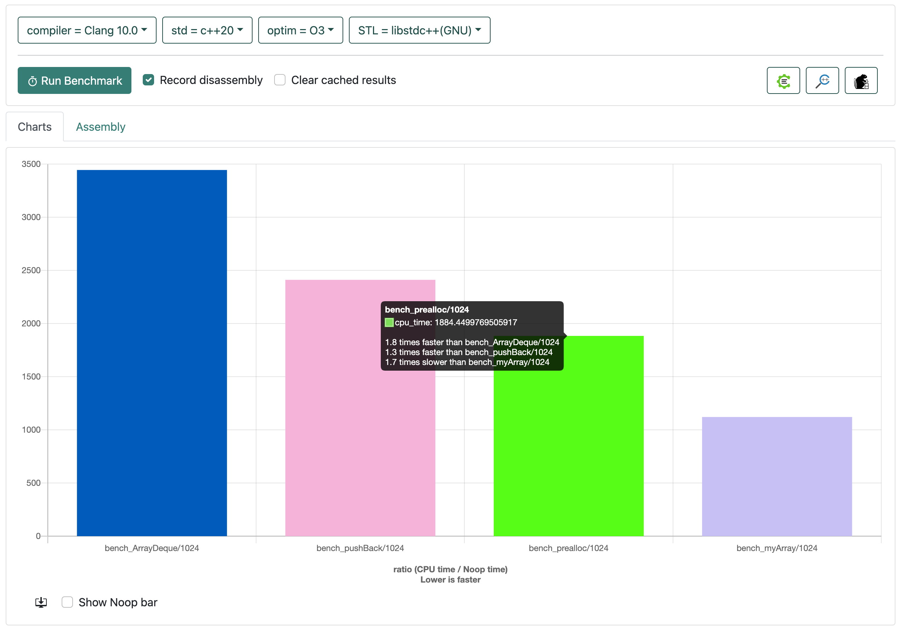

# Performance test `ArrayDeque` class `push_back` method using Benchmark

## Introduction

For testing performance of C++ code I use online [benchmark tool](https://quick-bench.com/) for testing performance.

## Performance test code in benchmark tool

```cpp
static void bench_ArrayDeque(benchmark::State& state) {
  const size_t howMany = state.range(0);
  for (auto _ : state) {
    ArrayDeque<int, 1024> result;
    for (int ii = 0; ii < howMany; ++ii) {
        result.push_back(ii * ii);
    }
    benchmark::DoNotOptimize(result);
  }
}
BENCHMARK(bench_ArrayDeque)->RangeMultiplier(rangeMultiplier)->Range(rangeMin, rangeMax);
```

## Working methods in `ArrayDeque` class when benchmark runs

1. `ArrayDeque()` - default constructor
2. `ArrayDeque.push_back(const T &value)` - add element at the end
3. `ArrayDeque.~ArrayDeque()` - destructor

## Implementation of `ArrayDeque` class

### `ArrayDeque()` - default constructor

```cpp
ArrayDeque() = default;
```

### `ArrayDeque.push_back(const T &value)` - add element at the end

```cpp
template <typename V>
void push_back(const V &value)
{
    m_assert(full(), "Array is full");
    init_on_empty(false);

    m_assert(!is_allowed_push_back(), "Please create a new object of ArrayDeque for pushing elements to back");
    new (end++) T(value);
}
```

### `ArrayDeque.~ArrayDeque()` - destructor

```cpp
~ArrayDeque()
{
    clear();
}
```

### Benchmark report

Below picture we see our implementation of `ArrayDeque` is too slower than other implementation of array, vector, etc.



### Why is it too slow?

### Problem

```cpp
// when we call method push_back() then it every time call these are methods:
// - full() in m_assert()
// - init_on_empty()
// - is_allowed_push_back()
template <typename V>
void push_back(const V &value)
{
    // assert calls method `full()` for checking Array is full or not.
    m_assert(full(), "Array is full"); // Problem #1

    // This function too calls every time when call method push_back().
    init_on_empty(false); // Problem #2

    m_assert(!is_allowed_push_back(), "Please create a new object of ArrayDeque for pushing elements to back"); // Problem #3
    new (end++) T(value);
}
```

```cpp
~ArrayDeque()
{
  // Add implementation of pop_back() to there instead of calling pop_back() in loop in clear()
  clear(); // Problem #4
}
```

> Note: Benchmark test [there](https://quick-bench.com/q/oWCR26KOhl2cueJXEqH2q_bPdGg).

